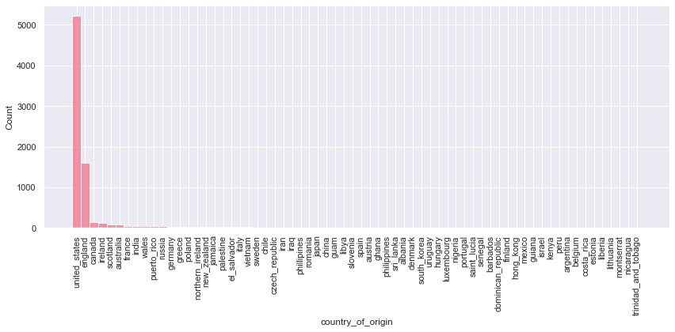
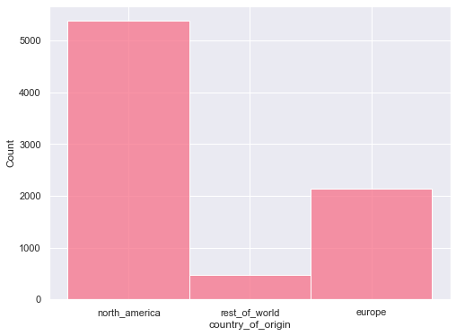
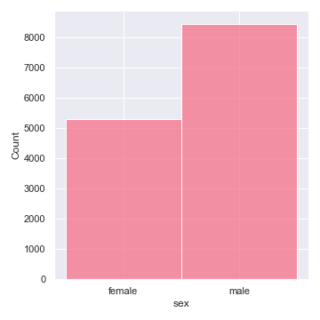
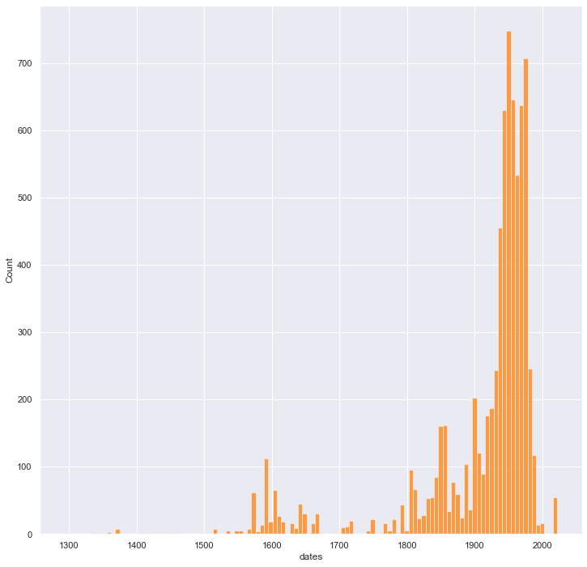
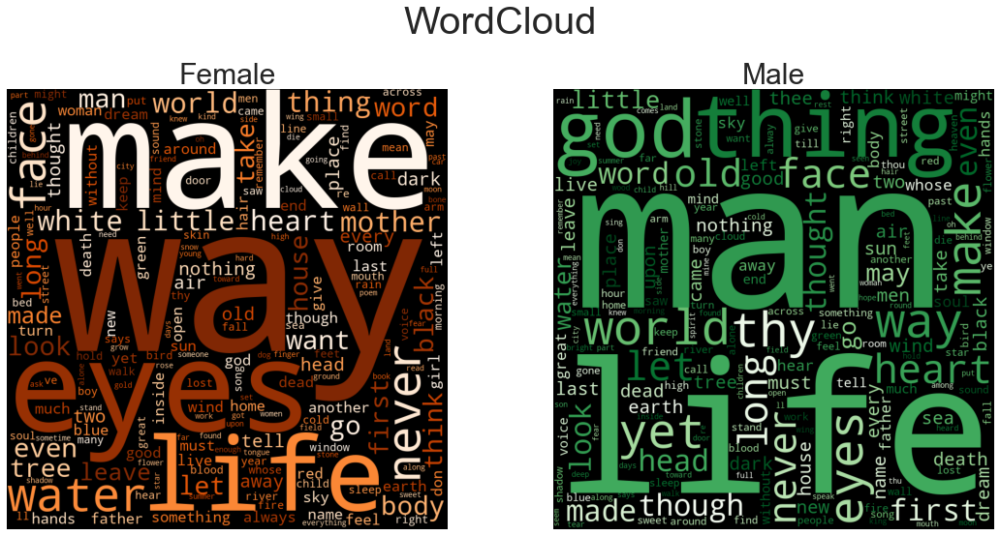
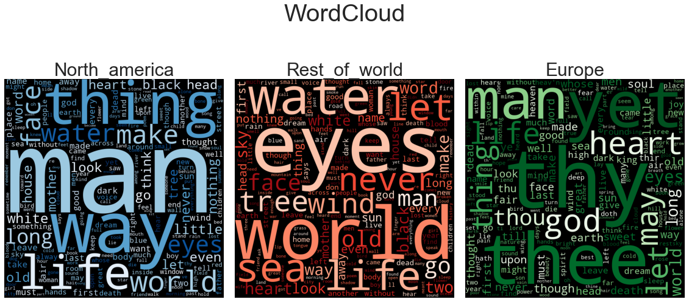
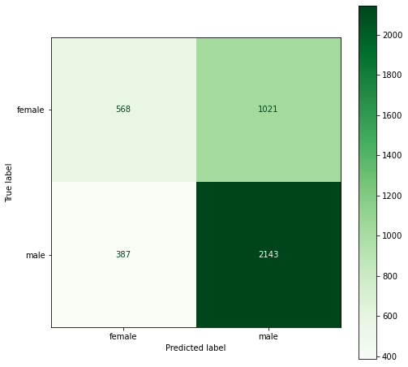
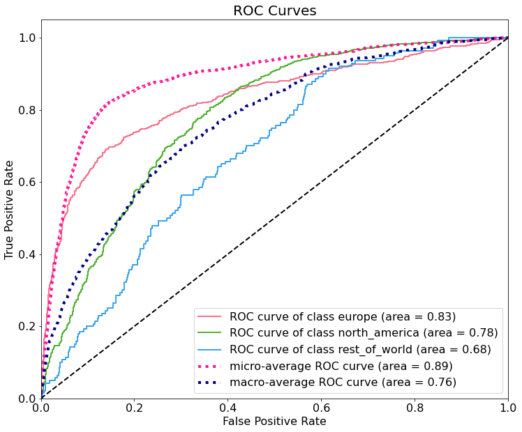
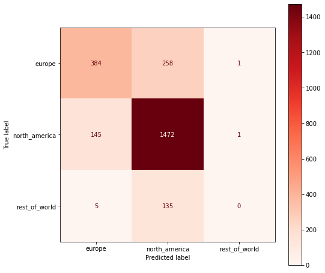
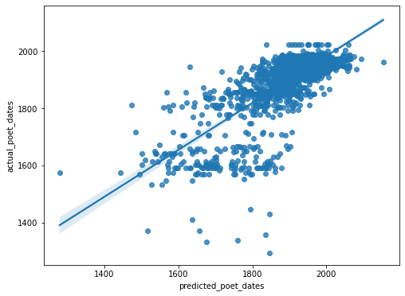

# Data is like poetry: predicting a poet's sex, continent of origin and dates based on their poetry

## Overview

This project was completed as part of the General Assembly Data Science Immersive course. It was a 5 week solo end-to-end project covering data collection; data cleaning and processing; exploratory data analysis; and data modelling and evaluation.

This document outlines the problem, hypothesis, methodology, conclusion and tools used.

-----

## Repository Contents

- Technical Report:

  - Executive Summary
  - Notebooks:

    - Data Collection
    - Data Cleaning
    - EDA
    - Model Evaluation

  - Models:

    - Dates Ridge regression
    - Sex Logistic Regression
    - Continent Logistic Regression

  - Plots:

    - EDA

      - Sex histogram
      - Country of origin histogram
      - Continent histogram
      - Dates histogram
      - Sex word cloud
      - Continent word cloud

    - Model Evaluation

      - Sex Confusion Matrix
      - Sex ROC plot
      - Continent Confusion Matrix
      - Continent ROC plot
      - Dates Regression Plot

- Read Me

*n.b. datasets are not included.*

-----

## Problem Statement

Everyone has their own unique way of using language. When I think, speak and write I am using English, but I am specifically using my English. But I don't exist in a vacuum -- the way I use language is influenced by my circumstances: where I live, who my friends are, the time I was born. You can learn a lot about me from the way I use language.

The aim of this model is to use data to explore this relationship and understand just how much we can tell about someone from how they use language.

-----

## Goals

This project had three goals. Taking a poem as an input, use NLP and feature engineering to build 3 models to predict the following details about its author:

- Sex
- Continent of origin *(originally country_of_origin)*
- Dates

To predict the sex and continent of origin of the poet, I have built 2 classification models. To predict each poet's dates, I have built a regression model.

-----

## Data Source

[Kaggle - Poetry Foundation](https://www.kaggle.com/tgdivy/poetry-foundation-poems/version/1)

The linked dataset contains 14,000 poems from Poetry Foundation.

All poems are labeled with the title, author and poetry foundation tags attached to them. This formed the spine of my final dataset.

Since the above dataset does not contain the target variables I am looking for, I used the poet column to compile a list of the poet's within the dataset. Then, using a combination of scraping wikipedia, probabilistic analysis based on first names and manual input, I labeled the rows with the target variables.

-----

## Cleaning & Processing

As mentioned above, the spine of the dataset did not include the target variables I wanted to predict. Therefore data cleaning and processing requirements centred principally around the following:

- Preparing target variables using web scrapes and probabilistic analysis of first names
- Removing html tags from title and poem columns
- Dummifying tag list to get usable tag columns
- Developing NLP regex token to capture words and punctuation

For a more detailed understanding of the data collection and cleaning process, please refer to the following notebooks:

[Data Collection Notebook](data-collection.ipynb)

[Data Cleaning Notebook](data-cleaning.ipynb)

-----

## Exploratory Data Analysis

The EDA process led me to draw the following conclusions from the dataset:

1. The class imbalance in the `country_of_origin` columns for this dataset has led me to aggregate the countries by their continent and use this as my target variable instead.

  
    ***Figure 1.** Histogram showing distribution of country of origin in poems dataset*

  
  ***Figure 2.** Histogram showing distribution of continent in poems dataset*

2. There is moderate class imbalance within the `sex` target column, with male being the largest class. This imbalance is not so drastic that I cannot build my model using this target variable.

  
  ***Figure 3.** Histogram showing distribution of sex in poems dataset*

3. The `dates` column has a negative skew, with most values falling between 1900 and 2000.

  
  ***Figure 4.** Histogram showing distribution of dates in poems dataset*

4. After creating word clouds for each sex and each continent, there are the following differences between how each group uses words:

### `sex`

  Initially, there was significant overlap in the words used by both sexes. Words, such as, 'now', 'love', 'eye' and 'will' were dominant for both classes. My thought here was not that there was no difference, but that there are words which are more commonly used in the English language across all sexes; the difference exists further down the rabbit hole.

  To handle this, I iteratively added words to my exception list (stopwords) to filter out the more dominant words across both sexes and used the following code to build the word clouds:

    ```python
    # Add words to stopwords list to filter out dominant words across both sexes
    stopwords = STOPWORDS.update(['now','know','eye','hand','love', 'day', 'see','will','one','see', 'light', 'say','back','us','time','come','night','still','said'])

    # Initialize matplotlib figure and axes to plot multiple plots at the same time
    fig, ax = plt.subplots(ncols = 2, figsize = (16,8))

    # Iterate through both sexes in poems and track index
    for index, sex in enumerate(poems.sex.unique()):

        # Initialize empty string
        poem_words = ''

        # Check if sex is None
        if sex is not None:

            # Iterate through all poems for given sex
            for poem in poems[poems.sex == sex]['poem'].values:
                # Add lower case words of poem to poem_words
                poem_words += poem.lower()
            
            # Set colour of wordcloud based on sex
            if sex == 'female':
                color = 'Oranges'
            else:
                color = 'Greens'

            # Create wordcloud using words in poem_words
            # Set width and height to 800
            # Set background colour to black
            # Set stopwords to stopwords list defined above
            # Set minimum font size to 12
            # Set color to color defined above by sex
            # Set regular expression to tokenize words
            wordcloud = WordCloud(width = 800, height = 800,
                                background_color = 'black',
                                stopwords = stopwords,
                                min_font_size = 12, colormap = color,
                                regexp = r'\w{2,}[\'\-]?\w*', include_numbers = True).generate(poem_words)

            # Plot wordcloud on axes based on index for sex
            ax[index].imshow(wordcloud)

            # Turn x and y axis off
            ax[index].axis("off")

            # Add ttitle to subplot to differentiate between wordclous
            ax[index].set_title(f'{sex.capitalize()}', fontsize = 30)
            
        else:
            # If sex is None, move on
            pass
      

    # Set title for total plot
    plt.suptitle('WordCloud', fontsize = 40)

    # Prevent overlapping by setting to tight layout
    plt.tight_layout(pad = 2)

    # Show plot
    plt.show()
    ```

  After doing this we were able to yield the following conclusions:

    - The words 'man' and 'thing' are used more predominantly by males.
    - Female poets seem use the words 'way' amd 'make' with more frequency.
    - Female poets use the word 'mother' far more than male poets.

  We can see there is great similarity between the sexes, but there is also some difference.

  
  ***Figure 5.** Word cloud showing how different sexes use words*

### `continent`

  For the continent wordcloud, i used the same set of stopwords I created from the sex plot from the beginning.

  We can see the following insights from the below word clouds:

    - The Europe word cloud is dominated by the words 'thee' and 'thy' - these are archaic terms, which make sense since England was the epicentre for poetry in the literary canon until the early 20th century.
    - 'Light' is a dominant word for North America, and it does not feature as heavily in Europe and the rest of the world.
    - 'God; is more dominant word for Europe, whereas it is less dominant for North America and the rest of the world.

  These word clouds are useful for showcasing that there are distinctions in terms of how language is used across geographical locations.

  
    ***Figure 6.** Word cloud showing how different continents use words*

For a detailed discussion of the above, and further analysis, see the following book:
[Exploratory Data Analysis](technical-report/EDA.ipynb)

-----

## NLP

The crux of this project is to use Natural Language Processing to predict characteristics about a poem's author. Therefore, a key decision to make during this project was how to approach the NLP component. I made the following decisions:

1. Use NLTK standard 'english' stopwords (This filters out words which are commonly used in English e.g. the, a, it)

2. Use TF-IDF vectorizer to give words with higher discriminatory poewer higher weights. i.e. if a word is used frequently in a poem, but infrequently within the entire corpus of poems, it will have a higher weight than those used frequently across all poems.

3. Use the following token_pattern to preserve punctuation during vectorization: `\w+[\'\-]?\w*|[.,/\\\-?;:!_()&]`. It is important to preserve punctuation during poetry analysis as punctuation use is very deliberate in poetry. This may provide discriminatory power.

4. Use ngram_range from 1 to 3. What this means is the vectorizer will create TF-IDF weights for single words, as well as combinations of up to and including 3 words. This causes a significant proliferation of the dataset.

Going forward, I want to create a pipeline for this process, whereby I can then use a Grid Search to optimise for the best set of stop words, best vectorizer, best token_pattern and best ngram_range. I have been unable to do so until now, because of the time constraints of the project.

-----

## Modelling Decisions

After the EDA, I have decided to create three models for this project to predict the following variables:

- Poet's sex
- Poet's continent_of_origin
- Poet's dates

I will use the following predictors:

- Poem (Natural Language Processing strategy outlined above)
- Number of lines
- Number of stanzas

### Sex

For this model I ran a GridSearch on a Logistic Regression. Logistic regressions tend to perform better when there is class imbalance because and Decision Tree will tend to predict the largest class every time.

I found the best estimator to be : `LogisticRegression(C=35.93813663804626, max_iter=10000)`.

I am suspicious of this, as this is the estimator with the maximum penalty applied in my GridSearch. As a next step, I would increase the maximum penalty allowed for this GridSearch.

### Continent_of_origin

Again, because of the class imbalance within the continent_of_origin column, for this model I ran a GridSearch on a Logistic Regression.

I found the best estimator to be : `LogisticRegression(C=100.0, max_iter=10000)`.

Similarly, I am suspicious of this, as this is also the estimator with the maximum penalty applied in my GridSearch. As a next step, I would increase the maximum penalty allowed for this GridSearch.

### Dates

For the model designed to predict a model's dates, I initially ran a Ridge regression to control for multi-collinearity. While this yielded good results, I had to create this model quickly in order to meet the project timeline.

With more time, I would like to run an ElasticNetCV to confirm the best penalty and best penalty ratio for this model.

-----

## Findings

All models overfit significantly to the training data, with training scores for all models ranging from 0.99 to 1.0. Therefore, in my analysis I have focused solely on the performance of the models on the test data.

### Sex

The baseline accuracy for this model was 61.41%. This means that if we guessed the largest class every time (male) we can expect to guess correctly 61.41% of the time. Therefore, for the model to be considered a success, it must have an accuracy score above 61.41%.

For the model designed to predict the sex of the poet, I found I was able to build a model that yielded the following accuracy scores:

- Mean cross-validated accuracy score: 0.6442 (64.42% of predictions were correct)
- Test accuracy score: 0.6514 (65.14% of predictions were correct)

This is an improvement of approximately 3% over the baseline accuracy.

Unsurprisingly, this yielded a model that was very good at correctly classifying male poets, but was less effective at identifying female poets with the majority of misclassifications being poems written by female poets that were classified as having been written by male poets.


***Figure 7.** Sex classifier confusion matrix*

The following condition will undermine the models predictive power of the sex of a poet:

- The sex for many poets was determined using a proabalistic analysis of their first names, assigning sex based on whether their first name more likely belongs ot male or female
  - This is not a foolproof way of corrcetly assigning the sex to a poet, firstly there are many names which are unisex, such as Alex. This method of categorisation may have mislabeled some poets.
  - Some female poets deliberately choose a male pen name, especially historically for commercial reasons. An example of this is George Eliot. My algorithm would have assigned male to her, even though she is known to be a female poet.
  - To mitigate this, I scraped the wikipedia pages for all poets with a wiki and used the pronouns used to assign a sex to them. Then for those without a wiki, I used the probablistic analysis.

Verifying the cleanliness of the data will allow us to vouchsafe the results of the model, and ensure the outputs we are receiving aren't warped by an imperfect dataset.

Nevertheless, this model still predicts more accurately than the baseline, and can therefore be considered a success.

### Continent

The baseline accuracy for the continent classifier is: 67.37%. This is the percentage of guesses we can expect to be correct if we guess North America as the continent of origin for every poem.

This model yielded the following accuracy scores:

- Mean cross-validation accuracy score: 0.7615 (76.15% of predictions were correct)
- Test accuracy score: 0.7730 (77.30% of predictions were correct)

The accuracy scores for this model show it is better at predicting where a poem originates than just predicting the largest class every time.

I also plotted an ROC curve to understand the intermingling of classes:


***Figure 8.** Continent ROC Plot*

The AUC-ROC shows us how the false positive rate for a given class grows as you increase the true positive rate. A perfect curve would be a vertical line from the origin up the y-axis, and then a horizontal line along the top of the graph. The AUC for a perfect curve is equal to 1. This tells us the closer the score is to 1, the better our model. An AUC score of 0.5 is equivalent to guessing at random.

The AUC score per class is:

- North America: 0.78
- Europe: 0.83
- Rest of the world: 0.68

All of these scores are greater than 0.5, and therefore the model is better at classifying each class than randomly guessing.

Finally, I have plotted a confusion matrix:


***Figure 9.** Continent confusion matrix*

From the above plot we can see that this model is very good at classifying poems from `north_america`, and is good at classifying poems from `europe`. It is, however, very poor at classifying poems from the rest of the world. This is unsurprising given the class imbalance within the dataset: only 6% of the poems within the dataset are from the rest of the world. The dominance of the other two classes makes it very unlikely the model will select a poem from the rest of the world.

The following condition is likely to undermine the model's ability to predict the continent of origin accurately (also listed in the executive summary):

- Translated poems may cloud the data set.
  - A poem originating from Germany for example will be said to have originated in Europe. If it was translated by someone from North America, however, the language used is more likely to reflect that used in North America rather than Europe.
  - This may apply to poems from the rest iof the world which may be able to be absorbed into categories.

For a more accurate model, it would be good to identify translated poems and find out who the translator is to better label where the English used comes from.

Despite this caveat, the model still is a better predictor than simply predicting the baseline prediction every time.

### Dates

The baseline for this model would be to guess the mean accuracy for every poet. Doing this would mean that we can explain none of the variance within the dataset, the measure for how much of the variance we can explain is called the r_squared score. Predicting the mean every time will yield a r_squared of 0.

For this model to be successful we must get an r-squared better than 0.

The cross-validation score, and test score are both approximately 0.56. This means the model explain 56% of the variance within the dataset. This is considerably better than the baseline prediction.

To visualise this, I created the following plot:


***Figure 10.** Dates Regression Plot*

After visualising the data, we can see that the model seems to reduce variance better for poems dating between 1800 and 2000. This is where the data set distribution is most dense. Where the dataset is more sparse (pre-1800), the model is less effective at minimising this variance.

The intercept for the model is approximately 1913. This means that when all inputs are 0, the model will still predict a meaningful value, which is not far from the mean.

The model, however, violates two assumptions for linear regression models: the assumption of homoscedasticity (that the variance in residuals for every lavel of x is constant) and the assumption that the distribution of residuals is normal. To counter this, I would transform the the dates column by taking the log of it. I would then rerun the model to check if this has solved the problem.

It is important to flag the following limitation for this model as well:

- Translated poems may cloud the data set.
  - If a poem from the 1300s was translated in 1920, the poem is more likely to reflect the language usage of 1920s rather than the 1300s.

I think confirming the translation dates for poems which have been translated would also improve the model.

For code and further discussion of model findings, see the following notebook:
[Model Evaluation](technical-report/model-evaluation.ipynb)

-----

## Risks, limitations and assumptions

- The sex for many poets was determined using a proabalistic analysis of their first names, assigning sex based on whether their first name more likely belongs ot male or female

  - This is not a foolproof way of corrcetly assigning the sex to a poet, firstly there are many names which are unisex, such as Alex. This method of categorisation may have mislabeled some poets.
  - Some female poets deliberately choose a male pen name, especially historically for commercial reasons. An example of this is George Eliot. My algorithm would have assigned male to her, even though she is known to be a female poet.
  - To mitigate this, I scraped the wikipedia pages for all poets with a wiki and used the pronouns used to assign a sex to them. Then for those without a wiki, I used the probablistic analysis.

- All poets in the dataset are the only person with their name with a wikipedia page.

  - This assumes that for a given poet 'T.S. Eliot,' there is only one wikipedia page for the poet, and the url of this page is given by the base wiki url followed by the name.
  - This assumption is dangerous because we may have read data from other people into the dataset, meaning some poets may have been labeled with other people's data.

- Translated poems may cloud the data set.

  - A poem originating from Germany for example will be said to have originated in Europe. If it was translated by someone from North America, however, the language used is more likely to reflect that used in North America rather than Europe.
  - Equally, if a poem from the 1300s was translated in 1920, the poem is more likely to reflect the language usage of 1920s rather than the 1300s.
  - There may still be thematic differences that the model can pick up in the language used in different parts of the world and across different languages however, although this may be difficult to interpret within the model.

- The size of the dataset made computation speeds slow, limiting my ability to tune parameters within project timeframe. Now all deliverables have been met for this project, I can tune the models and try different parameters.

-----

## Conclusion

Despite the pitfalls outlined in the above section, we can still call this project a success. Every model I built is an improvement on the baseline prediction. There is scope for improvement (outlined in the next section), but given the time pressure for deliverables, I think the above work is a very good platform for further refinement of the project.

-----

## Next Steps

- Make more of the unused data I collected.

  - During the wikipedia scraping for each poet, I had several poets where I had a successful scrape, but the format of the wiki page did not follow the same format as the majority. Therefore, we have the information for these poets, but this info has no yet been extracted. I would go on to extract this information.
  - I extracted all poetry foundation tags which went unused as predictors. These could be valuable as perhaps there are differentiators between sex, continent and dates based on theme.

- More feature engineering
  
  - This is a very rich dataset with significnt scope for feature engineering. I want to create word groups and identify if these groups appear in the poems. Equally, more work on encoding the structure of each poem could be valuable, such as words per line, or meter.

- Verify data cleanliness

  - There are several limitations as outlined above which boil down to data cleanliness. Due to time pressures, I was not as meticulous in verifying the quality of the data as I would have liked to have been. Going forward, I will do more data cleaning and verification to ensure accuracy.

- Transform dates column to improve reliability of dates regression model

  - A quick improvement that can be made to this project is to transform the dates model and check if the assumption violations outlined in the findings section have gone. If those assumptions are no longer being violated then the reliability of this model will improve.

- Make a website with an API and training and testing tabs so people can try the model out on their own poems

  - The final step I would like to take after the above has been completed is to deploy the model, and make it available to the public
